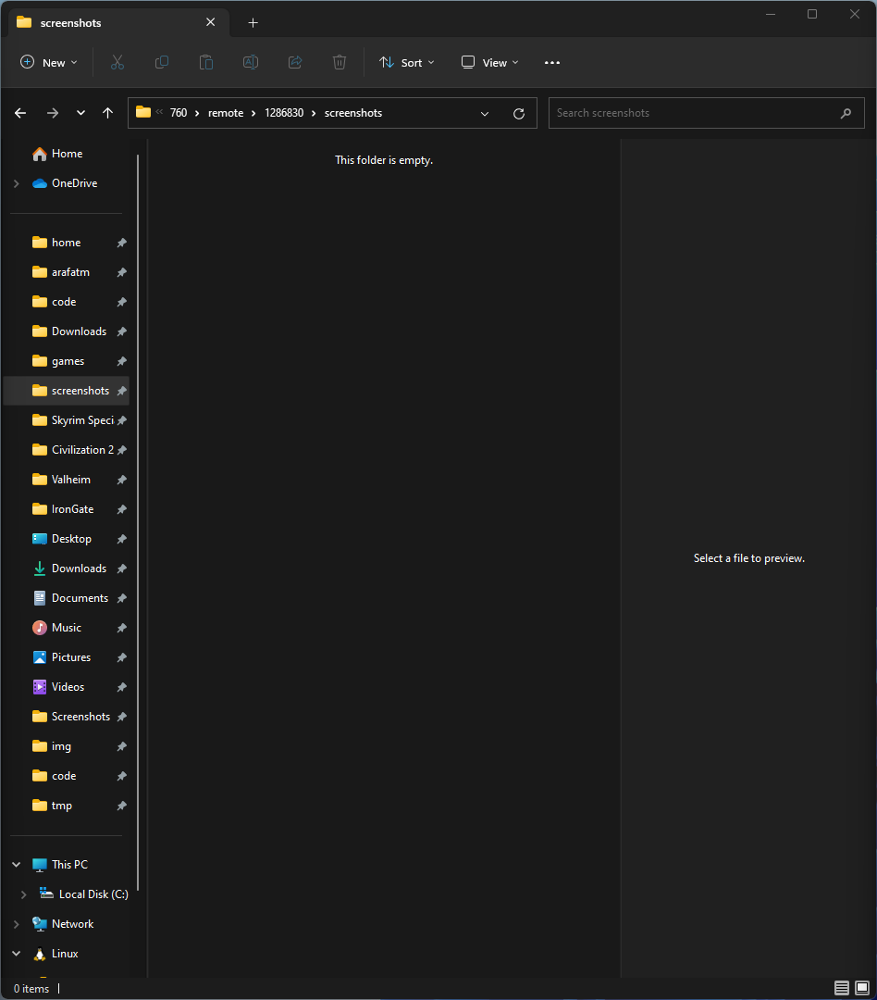
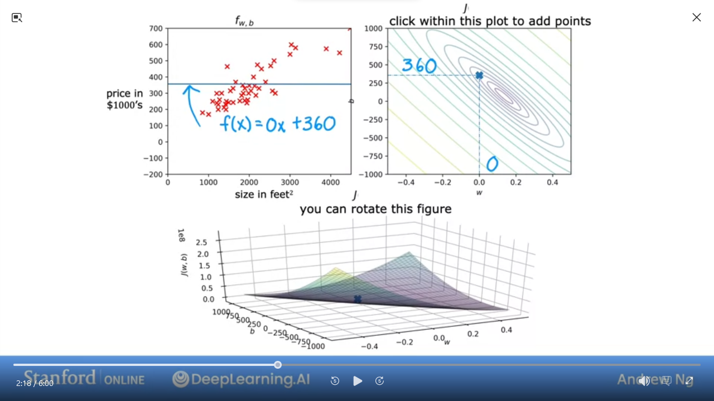
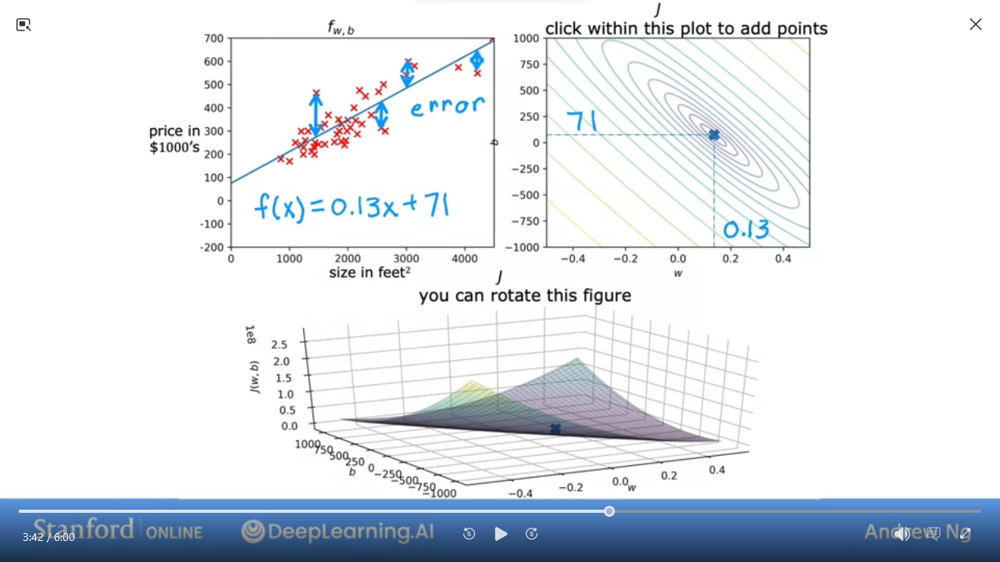

# [Machine Learning | Coursera](https://www.coursera.org/specializations/machine-learning-introduction)

- [Discourse  - DeepLearning.AI](https://community.deeplearning.ai/top?period=daily)


<!-- vim-markdown-toc GFM -->

* [C1 Supervised Machine Learning: Regression and Classification](#c1-supervised-machine-learning-regression-and-classification)
  * [W1 Introduction to Machine Learning](#w1-introduction-to-machine-learning)
    * [1.1.1 Supervised vs Unsuperverside Machine Learning](#111-supervised-vs-unsuperverside-machine-learning)
      * [1.1.1.1 What is machine learning?](#1111-what-is-machine-learning)
      * [1.1.1.2 Supervised Learning: Regression Algorithms](#1112-supervised-learning-regression-algorithms)
      * [1.1.1.3 Supervised Learning: Classification](#1113-supervised-learning-classification)
      * [1.1.1.4 Unsupervised Learning](#1114-unsupervised-learning)
        * [Question: Of the following examples, which would you address using an unsupervised learning algorithm?](#question-of-the-following-examples-which-would-you-address-using-an-unsupervised-learning-algorithm)
      * [Lab: Python and Jupyter Notebooks](#lab-python-and-jupyter-notebooks)
      * [Quiz: Supervised vs Unsupervised Learning](#quiz-supervised-vs-unsupervised-learning)
    * [1.1.2 Regression Model](#112-regression-model)
      * [1.1.2.1 Linear regression model part 1](#1121-linear-regression-model-part-1)
      * [1.1.2.2 Linear regression model part 2](#1122-linear-regression-model-part-2)
      * [Lab: Model representation](#lab-model-representation)
      * [1.1.2.4 Cost function formula](#1124-cost-function-formula)
        * [Question: Which of these parameters of the model that can be adjusted?](#question-which-of-these-parameters-of-the-model-that-can-be-adjusted)
      * [1.1.2.5 Cost Function Intuition](#1125-cost-function-intuition)
      * [1.1.2.6 Visualizing the cost function](#1126-visualizing-the-cost-function)
      * [1.1.2.7 Visualization examples](#1127-visualization-examples)
      * [Lab: Cost function](#lab-cost-function)
      * [Quiz: Regression Model](#quiz-regression-model)
    * [1.1.3 Train the model with gradient descent](#113-train-the-model-with-gradient-descent)
      * [1.1.3.1 Gradient descent](#1131-gradient-descent)
      * [1.1.3.2 Implementing gradient descent](#1132-implementing-gradient-descent)
      * [1.1.3.3 Gradient descent intuition](#1133-gradient-descent-intuition)
      * [1.1.3.4 Learning rate](#1134-learning-rate)
      * [1.1.3.5 Gradient descent for linear regression](#1135-gradient-descent-for-linear-regression)
      * [1.1.3.6 Running gradient descent](#1136-running-gradient-descent)
      * [Lab: Gradient descent](#lab-gradient-descent)

<!-- vim-markdown-toc -->

## [C1 Supervised Machine Learning: Regression and Classification](https://www.coursera.org/learn/machine-learning/home/info)

### W1 Introduction to Machine Learning

#### 1.1.1 Supervised vs Unsuperverside Machine Learning

##### 1.1.1.1 What is machine learning?

> Field of study that gives computers the ability learn without being explicitly pogrammed -- Arthur Samuel

Supervised vs Unsupervised

##### 1.1.1.2 Supervised Learning: Regression Algorithms 

> learn x to y or input to output mappings

| Input (x)      | Output (Y)             | Application         |
| -              | -                      | -                   |
| email          | spam? (0/1)            | spam filtering      |
| audio          | text transcripts       | speech recognition  |
| Enlish         | Spanish                | machine translation |
| ad, user       | click? (0/1)           | online advertising  |
| image, radar   | position of other cars | self-driving car    |
| image of phone | defect? (0/1)          | visual inspection   |


- Use different algorithms to predict price of house based on data

##### 1.1.1.3 Supervised Learning: Classification 

`Regression` attempts to predict ininite possible results
`Classification` **predicts categories** ie from limited possible results


- e.g. Breast cancer detection


- we can have multiple outputs


- we can draw a boundary line to separate our output

Supervised Learning

|          | Regression | Classification |
| -        | -          | -              |
| Predicts | numbers    | categories     |
| Outputs  | infinite   | limited        |

##### 1.1.1.4 Unsupervised Learning 


- With unsupervised we don't have predetermined expected output
- we're trying to find structure in the pattern
- in this example it's `clustering`
- e.g. Google News will "cluster" news related to pandas given a specific article about panda/birth/twin/zoo


- e.g. given set of individual genes, "cluster" similar genes


- e.g. how deeplearning.ai categorizes their learners

> `Unsupervised Learning`: Data only comes with inputs x, but not output labels y. 
> Algorithm has to find _structure_ in the data  
> - `Clustering`: Group similar data points together
> - `Anomaly Detection`: Find unusual data points
> - `Dimensionality Reduction`: Compress data using fewer numbers

###### Question: Of the following examples, which would you address using an unsupervised learning algorithm?  

(Check all that apply.)
- [ ] Given a set of news articles found on the web, group them into sets of articles about the same stories.
- [ ] Given email labeled as spam/not spam, learn a spam filter.
- [ ] Given a database of customer data, automatically discover market segments and group customers into different market segments.
- [ ] Given a dataset of patients diagnosed as either having diabetes or not, learn to classify new patients as having diabetes or not.

##### Lab: Python and Jupyter Notebooks

[Python and Jupyter Notebooks | Coursera](https://www.coursera.org/learn/machine-learning/ungradedLab/rNe84/python-and-jupyter-notebooks/lab?path=%2Fnotebooks%2FC1_W1_Lab01_Python_Jupyter_Soln.ipynb)

##### Quiz: Supervised vs Unsupervised Learning

Which are the two common types of supervised learning (choose two)
- [ ] Classificaiton
- [ ] Regression
- [ ] Clustering

Which of these is a type of unsupervised learning?
- [ ] Clustering
- [ ] Regression
- [ ] Classification

#### 1.1.2 Regression Model

##### 1.1.2.1 Linear regression model part 1

`Linear Regression Model` => a **Supervised Learning Model** that simply puts a line through a dataset
- most commonly used model


- e.g. Finding the right house price based on dataset of houses by sq ft.

| Terminology  |                                 |
| -:           | :-                              |
| Training Set | data used to train the model    |
| x            | *input* variable or **feature**
| y            | *output* variable or **target**
| m            | number of training examples
| (x,y)        | single training example
| (xⁱ,yⁱ)      | i-th training example

##### 1.1.2.2 Linear regression model part 2

```mermaid
flowchart TD

A[training set] --> B[learning algorithm]
B --> F[f (function)]
```

`f` is a linear function with _one_ variable
- $`f_{w,b}(x) = wx + b`$ is equivalent to 
- $`f(x) = wx + b`$


- `Univariate` linear regression => one variable

##### [Lab: Model representation](https://www.coursera.org/learn/machine-learning/ungradedLab/PhN1X/optional-lab-model-representation/lab)

Here is a summary of some of the notation you will encounter.  

| General Notation        | Python (if applicable) | Description                                                                                                   |
| :--                     | :--                    | :--                                                                                                           |
| $`a`$                  |                        | scalar, non bold                                                                                              |
| $`\mathbf{a}`$         |                        | vector, bold                                                                                                  |
| **Regression**          |                        |                                                                                                               |  |
| $`\mathbf{x}`$         | `x_train`              | Training Example feature values (in this lab - Size (1000 sqft))                                              |
| $`\mathbf{y}`$         | `y_train`              | Training Example  targets (in this lab Price (1000s of dollars))
| $`x^{(i)}$, $y^{(i)}`$ | `x_i`, `y_i`           | $`i_{th}`$ Training Example                                                                                      |
| m                       | `m`                    | Number of training examples                                                                                   |
| $`w`$                  | `w`                    | parameter: weight                                                                                             |
| $`b`$                  | `b`                    | parameter: bias                                                                                               |
| $`f_{w,b}(x^{(i)})`$   | `f_wb`                 | The result of the model evaluation at $`x^{(i)}`$ parameterized by $`w,b`$: $`f_{w,b}(x^{(i)}) = wx^{(i)}+b`$ |

Code
- `NumPy`, a popular library for scientific computing
- `Matplotlib`, a popular library for plotting data
  - `scatter()` to plot on a graph
    - `marker` for symbol to use
    - `c` for color

##### 1.1.2.4 Cost function formula


- We can play with `w` & `b` to find the best fit line


- 1st step to implement linear function is to define `Cost Function`
-  Given $`f_{w,b}(x) = wx + b`$ where `w` is the `slope` and `b` is the `y-intercept` 
- `Cost function` takes  predicted $`\hat{y}`$ and compares to `y`
- ie `error` = $`\hat{y} - y`$ 
- $`\sum\limits_{i=1}^{m} (\hat{y}^{(i)} - y^{(i)})^{2}`$ 
  - where `m` is the number of training examples
- Dividing by `2m` makes the calculation neater $`\frac{1}{2m} \sum\limits_{i=1}^{m} (\hat{y}^{(i)} - y^{(i)})^{2}`$ 
- Also known as `squared error cost function` $`J_{(w,b)} = \frac{1}{2m} \sum\limits_{i=1}^{m} (\hat{y}^{(i)} - y^{(i)})^{2}`$ 
- Which can be rewritten as $`J_{(w,b)} = \frac{1}{2m} \sum\limits_{i=1}^{m} (f_{w,b}(x^{(i)}) - y^{(i)})^{2}`$ 
- Remember we want to find values of `w,b` where $`\hat{y}^{(i)}`$ is close to $`y^{(i)}`$ for all $`(x^{(i)}, y^{(i)})`$

###### Question: Which of these parameters of the model that can be adjusted?
- $`w`$ and $`b`$
- $`f_{w,b}`$
- $`w`$ only, because we should choose $`b = 0`$
- $`\hat{y}`$

##### 1.1.2.5 Cost Function Intuition

To get a sense of how to minimize $`J`$ we can use a simplified model

|               |                                                                                     | simplified |
| --            | --                                                                                  | --         |
| model         | $`f_{w,b}(x) = wx + b`                                                              | $`f_{w}(x) = wx` by setting $`b=0`$                                                              |
| parameters    | $`w`$, $`b`$                                                                        | $`w`$
| cost function | $`J_{(w,b)} = \frac{1}{2m} \sum\limits_{i=1}^{m} (f_{w,b}(x^{(i)}) - y^{(i)})^{2}`$ | $`J_{(w)} = \frac{1}{2m} \sum\limits_{i=1}^{m} (f_{w}(x^{(i)}) - y^{(i)})^{2}`$ |
| goal          | we want to minimize $`J_{(w,b)}`$                                                   | we want to minimize $`J_{(w)}`$                                                   |


- we can use simplified function to find the best fit line 


- the 2nd graph shows that when $`w = 1`$ then $`J(1) = 0`$


- the 2nd graph shows that when $`w = 0.5`$ then $`J(0.5) ~= 0.58`$


- the 2nd graph shows that when $`w = 0`$ then $`J(0) ~= 2.33`$


- We can do this calculation for various $`w`$ even negative numbers
- when $`w = -0.5`$ then $`J(-0.5) ~= 5.25`$


- We can plot various values for `w` and get a graph (on the right)
- As we can see the cost function with $`w = 1`$ is the best fit line for __this data__

> :bulb: The goal of linear regression is to find the values of $`w,b`$ that
> allows us to minimize $`J_{(w,b)}`$
x
##### 1.1.2.6 Visualizing the cost function

|               |                                                                                     |
| --            | --                                                                                  |
| model         | $`f_{w,b}(x) = wx + b`                                                              |
| parameters    | $`w`$, $`b`$                                                                        |
| cost function | $`J_{(w,b)} = \frac{1}{2m} \sum\limits_{i=1}^{m} (f_{w,b}(x^{(i)}) - y^{(i)})^{2}`$ |
| goal          | minimize $`J_{(w,b)}`$                                                              |


- When we only have w, then we can plot `J` vs `w` in 2-dimensions


- However, when we add `b` then it's 3-dimensional
- The value of `J` is the height


- this is easier to visualize as a `contour plot`


- Same as used to visualize height of mountains


- take a horizontal slice which gives you the same `J` for given `w,b`
- the center of the contour is the minimum
- __Countour__ allows us to visualize the 3-D `J` in 2-D

##### 1.1.2.7 Visualization examples

Here are some examples of `J`


- We can see this is a pretty bad `J`


- A little less bad `J`


- This is pretty good and close to minimal (but not quite perfect)

In the next lab, you can click on different points on the contour to view the cost function on the graph

> `Gradient Descent` is an algorithm to train linear regression and other complex models 

##### [Lab: Cost function](https://www.coursera.org/learn/machine-learning/ungradedLab/udPHh/optional-lab-cost-function/lab?path=%2Fnotebooks%2FC1_W1_Lab03_Cost_function_Soln.ipynb)

[Lab: Cost Function](/code/C1_W1_Lab03_Cost_function_Soln.ipynb)
- `from lab_utils_uni import plt_intuition, plt_stationary, plt_update_onclick, soup_bowl`

##### Quiz: Regression Model

1. Which of the following are the inputs, or features, that are fed into the model and with which the model is expected to make a prediciton?
- [ ] $`m`$
- [ ] $`w`$ and $`b`$
- [ ] $`(x,y)`$
- [ ] $`x`$

2. For linear regression, if you find parameters $`w`$ and $`b`$ so that $`J_{(w,b)}`$ is very close to zero, what can you conclude?
- [ ] The selected values of the parameters $`w, b`$ cause the algorithm to fit the training set really well
- [ ] This is never possible. There must be a bug in the code
- [ ] The selected values of the parameters $`w, b`$ cause the algorithm to fit the training set really poorly

<details><summary>Ans</summary>4, 1</details>

#### 1.1.3 Train the model with gradient descent

##### 1.1.3.1 Gradient descent

Want a systematic way to find values of $`w,b`$ that allows us to easily find
smallest $`J`$

`Gradient Descent` is an algorithm used for any function, not just in linear
regression but also in advanced neural network models


- start with some $`w,b`$ e.g. $`(0,0)`$
- keep changing $`w,b`$ to reduce $`J(w,b)`$
- until we settle at or near a minimume


- Example of a more comples $`J`$
- not a squared error cost
- not linear regression
- we want to get to the lowest point in this topography
- pick a direction and take a step that is slightly lower
  - repeat until you're at lowest point
- However, depending on starting point and direction, you will end up at a different "lowest point"
  - Known as `local mimina`

> `local minima` may not be the true lowest point

##### 1.1.3.2 Implementing gradient descent


- The `Gradient Descent` algorithm
- $`w = w - \alpha \frac{\partial}{\partial w} J_{(w,b)}`$
  - $`\alpha`$ == `learning rate`. ie How "big a step" you take down the hill
  - $`\frac{\partial}{\partial w} J_{(w,b)}`$ == `derivative`. ie which direction
- $`b = b - \alpha \frac{\partial}{\partial b} J_{(w,b)}`$
- We repeat these 2 steps for $`w,b`$ until the algorithm __converges__
  - ie each subsequent step doesn't change the value
- We want to _simultaneously_ update w and b at each step
  - `tmp_w =` $`w - \alpha \frac{\partial}{\partial w} J_{(w,b)}`$
  - `tmp_b =` $`b - \alpha \frac{\partial}{\partial b} J_{(w,b)}`$
  - `w = tmp_w && b = tmp_b`

##### 1.1.3.3 Gradient descent intuition


```math
\begin{align}
\text{repeat until convergence \{}

  &w = w - \alpha \frac{\partial}{\partial w} J_{(w,b)}\\
  &b = b - \alpha \frac{\partial}{\partial b} J_{(w,b)}\\
\}
\end{align}
```

```math
\begin{align}
\text{repeat until convergence \{} \\ 
  &w = w - \alpha \frac{\partial}{\partial w} J_{(w,b)}\\
  &b = b - \alpha \frac{\partial}{\partial b} J_{(w,b)}\\
\}
\end{align}
```

##### 1.1.3.4 Learning rate
##### 1.1.3.5 Gradient descent for linear regression
##### 1.1.3.6 Running gradient descent
##### Lab: Gradient descent
<!-- vim: set textwidth=0: -->
<!-- vim: set wrapmargin=0: -->
<!-- vim: set nowrap: -->
<!-- vim: set foldlevel=9: -->
