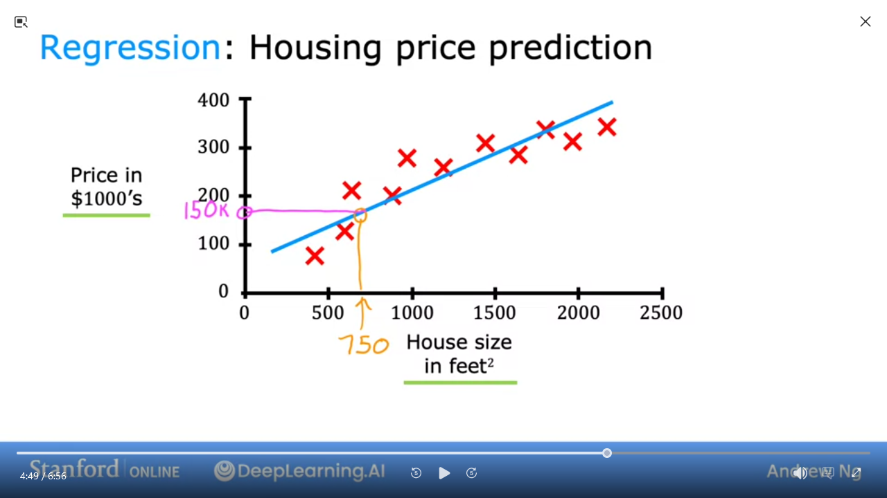

# [Machine Learning | Coursera](https://www.coursera.org/specializations/machine-learning-introduction)

- [Discourse  - DeepLearning.AI](https://community.deeplearning.ai/top?period=daily)

## 1. [Supervised Machine Learning: Regression and Classification](https://www.coursera.org/learn/machine-learning/home/info)

### 1.1: Introduction to Machine Learning

#### What is machine learning?

> Field of study that gives computers the ability learn without being explicitly pogrammed -- Arthur Samuel

Supervised vs Unsupervised

#### Supervised Learning 

> learn x to y or input to output mappings

| Input (x)      | Output (Y)             | Application         |
| -              | -                      | -                   |
| email          | spam? (0/1)            | spam filtering      |
| audio          | text transcripts       | speech recognition  |
| Enlish         | Spanish                | machine translation |
| ad, user       | click? (0/1)           | online advertising  |
| image, radar   | position of other cars | self-driving car    |
| image of phone | defect? (0/1)          | visual inspection   |

#### Unsupervised Learning 

#### Jupyter Notebooks
#### **Lab:** Python and Jupyter Notebooks
#### Linear regression model part 1
#### Linear regression model part 2
#### **Lab:** Optional lab: Model representation
#### Cost function formula
#### Cost function intuition
#### Visualizing the cost function
#### Visualization examples
#### **Lab:** Optional lab: Cost function
#### Gradient descent
#### Implementing gradient descent
#### Gradient descent intuition
#### Learning rate
#### Gradient descent for linear regression
#### Running gradient descent
#### **Lab:** Optional lab: Gradient descent
#### **Quiz**: Supervised vs unsupervised learning
#### **Quiz**: Regression
#### **Quiz**: Train the model with gradient descent
### Regression with multiple input variables
#### Multiple features
#### Vectorization part 1
#### Vectorization part 2
#### **Lab:** Optional lab: Python, NumPy and vectorization
#### Gradient descent for multiple linear regression
#### **Lab:** Optional Lab: Multiple linear regression
#### Feature scaling part 1
#### Feature scaling part 2
#### Checking gradient descent for convergence
#### Choosing the learning rate
#### **Lab:** Optional Lab: Feature scaling and learning rate
#### Feature engineering
#### Polynomial regression
#### **Lab:** Optional lab: Feature engineering and Polynomial regression
#### **Lab:** Optional lab: Linear regression with scikit-learn
#### **Quiz**: Multiple linear regression
#### **Quiz**: Gradient descent in practice
#### Week 2 practice lab: Linear regression
### 1.3: Classification
#### Motivations
#### **Lab:** Optional lab: Classification
#### Logistic regression
#### **Lab:** Optional lab: Sigmoid function and logistic regression
#### Decision boundary
#### **Lab:** Optional lab: Decision boundary
#### Cost function for logistic regression
#### **Lab:** Optional lab: Logistic loss
#### Simplified Cost Function for Logistic Regression
#### **Lab:** Optional lab: Cost function for logistic regression
#### Gradient Descent Implementation
#### **Lab:** Optional lab: Gradient descent for logistic regression
#### **Lab:** Optional lab: Logistic regression with scikit-learn
#### The problem of overfitting
#### Addressing overfitting
#### **Lab:** Optional lab: Overfitting
#### Cost function with regularization
#### Regularized linear regression
#### Regularized logistic regression
#### **Lab:** Optional lab: Regularization
#### Andrew Ng and Fei-Fei Li on Human-Centered AI
#### Reading: Acknowledgments
#### **Quiz**: Classification with logistic regression
#### **Quiz**: Cost function for logistic regression
#### **Quiz**: Gradient descent for logistic regression
#### **Quiz**: The problem of overfitting
#### Week 3 practice lab: logistic regression
